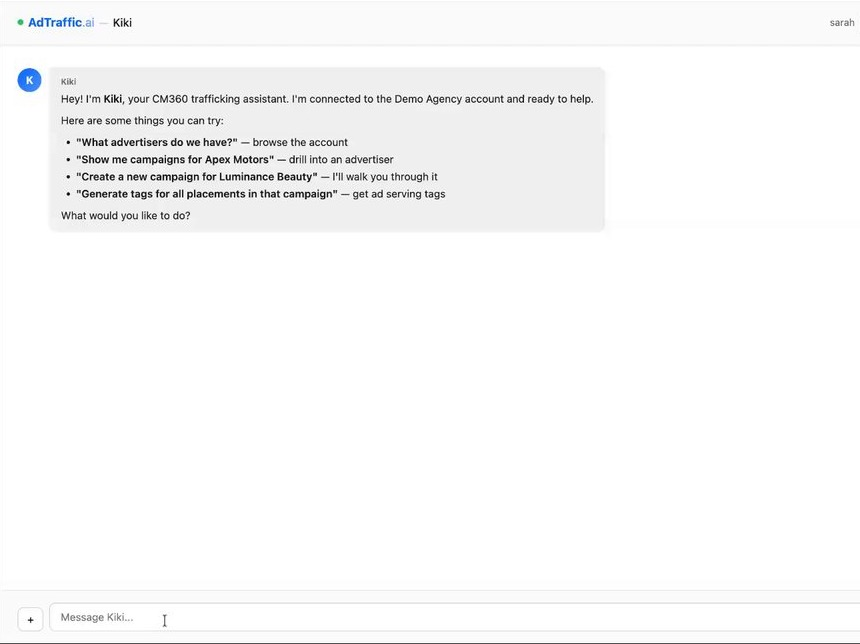

# AdTraffic.ai — Kiki

[](https://github.com/kikiavalon/adtraffic/actions/workflows/ci.yml)
[](https://github.com/kikiavalon/adtraffic/actions/workflows/security.yml)
[](LICENSE)
[](https://nodejs.org)

**An open-source conversational trafficking assistant for Google Campaign Manager 360 (CM360).**

Kiki is a complete assistant, not a bare API connector: it pairs the CM360 API with built-in trafficking domain expertise (naming conventions, UTM/click-through resolution, VAST/video), write-safety confirmations, and automated post-write QA — behind a natural-language chat interface and a web app. It can **write** to CM360 (create and update campaigns, placements, ads, creatives, tags), not merely read it.

> ⚠️ **The live CM360 path is unverified.** Kiki writes to systems that control
> real ad spend. All 70 tools are implemented; none has been exercised against
> Google's production API. Demo mode is the tested experience.
> **Use at your own risk** — see [DISCLAIMER.md](DISCLAIMER.md).

## Demo

[](https://www.loom.com/share/49182b1a028b4931a15602b423b301ef)

Short walkthroughs (click to watch):

- **[Expert Trafficking Desk](https://www.loom.com/share/49182b1a028b4931a15602b423b301ef)** — a full session with Kiki
- **[Quick Tag Pull](https://www.loom.com/share/42f380b149d1471eb67b0a7bb76766d3)** — generating ad serving tags
- **[Create a Campaign & Placements](https://www.loom.com/share/3a28b5e53e9e464daf52080df728ff16)** — building a campaign and placements from a natural-language request

## Why this exists

Google sunset **Bulkdozer** — its open-source bulk-trafficking tool — in August 2023, leaving traffickers without a scriptable, safety-checked way to make changes at scale. AdTraffic treats **agent behavior as a product spec**. Every mutating action is previewed and confirmed, tool inputs are validated with Zod, and a built-in QA pass re-reads what changed and click-tests the resulting ad tags. The goal is a tool a trafficker managing real ad spend could actually trust.

## Quick start (demo mode — no database, no CM360 account)

You only need Node.js ≥ 20.

```bash
npm install
npm run build --workspace=shared
export DEMO_MODE=true
npm run dev                            # backend on :3001, webapp on :5173
```

Open http://localhost:5173 and sign up. Kiki uses **your own** Claude API key — open **Settings → Claude API** and paste a key from [console.anthropic.com](https://console.anthropic.com/settings/keys); it's verified and stored encrypted, and chat stays disabled until it's connected. Then ask Kiki to "list advertisers" or "create a campaign." Everything runs against seeded, deterministic mock CM360 data — no Google account required.

> **`npm install` prints audit warnings — that's expected.** They're almost all dev/build tooling (e.g. `esbuild` via `tsx` and `drizzle-kit`) and don't affect the demo. **Don't run `npm audit fix --force`** — dependencies are pinned to exact, tested versions, and `--force` swaps in incompatible majors that break the build. To harden a dependency, open a PR with a targeted, in-range bump instead.

## Try it over MCP (Model Context Protocol)

`@adtraffic/mcp` is a zero-credential stdio MCP server that exposes all 70 CM360 tools against the same seeded mock data — usable from Claude Desktop or any MCP client. No Claude key needed; it's just the tool surface over mock data.

Run it directly — no clone, no build:

```bash
npx @adtraffic/mcp                     # stdio MCP server
```

Or build from source (contributors):

```bash
npm run build --workspace=shared
npm run build --workspace=mcp
node mcp/dist/index.js                 # stdio MCP server
```

Point your MCP client at that command.

## Tool coverage — honest status

Kiki ships **70 CM360 tools** (validated against CM360 API v5).

| | Count | Notes |
|---|---|---|
| **Tools total** | 70 | read, create, update, tags, reporting, floodlight, event tags, placement groups, user/role, more |
| **Live-implemented** | 70 | every tool has a real CM360 API code path; `STUBBED_TOOLS` is empty |
| **Verified against a real CM360 account** | 0 | the live path has not been, and will not be, exercised against Google's API |
| **Delete tools** | 0 | by design |

⚠️ **The live CM360 path is beta and has never been exercised against the real API.** Every tool is fully wired, but none has been proven against Google's production CM360. It is provided for those bringing their own Google credentials — treat it as unverified. The demo/mock path is what the test suite exercises and is the supported experience. See [DISCLAIMER.md](DISCLAIMER.md) before connecting a real account.

## Architecture

An npm-workspaces monorepo:

```
shared/     → TypeScript types, Zod schemas, and the dependency-free mock CM360 layer (@adtraffic/shared/mock-cm360)
backend/    → Express API: auth, chat, the Claude agentic loop, CM360 tool executor, feature flags, OAuth
webapp/     → React 19 + Vite web app (Kiki chat, settings)
mcp/        → @adtraffic/mcp — stdio MCP server over the mock CM360 layer
qa-runner/  → headless click-through QA runner (Playwright)
```

CM360 calls are made **server-side** (never in the browser); campaign data transits the server for the API call. It is not cached or used for advertising, but campaign details are stored in conversation logs and, transiently, in pending write actions and QA runs. OAuth tokens, when used, are encrypted at rest.

## Tests

```bash
npm run build && npm run typecheck && npm run lint && npm test   # the full gate (2,552 tests)
```

`shared`, `mcp`, and `webapp` suites need no services. The `backend` suite needs a local Postgres:

```bash
createdb adtraffic_test
export DATABASE_URL="postgres://localhost:5432/adtraffic_test"
npx --prefix backend drizzle-kit push
npm test --workspace=backend
```

`qa-runner`'s 5 end-to-end tests need Chromium (Playwright). See [CONTRIBUTING.md](CONTRIBUTING.md) for the full setup.

## Database schema & migrations

The schema lives in `backend/src/db/schema.ts`. Versioned migrations are generated into `backend/drizzle/` and applied by the `migrate` step of `docker compose up` (or `npm run db:migrate --workspace=backend` against a built backend). After changing the schema, run `npm run db:generate --workspace=backend` and commit the new files.

The `drizzle-kit push` shown above is a quick path for throwaway dev/test databases; it creates tables without recording the migration ledger. If you have a persistent database that was created with `drizzle-kit push` and want to switch it to the migrate flow, drop and recreate it (or baseline the ledger), since the migrator will otherwise try to recreate existing tables.

## Using the live CM360 API (bring your own credentials)

To connect Kiki to a real CM360 account you supply your own Google OAuth2 client (`GOOGLE_CLIENT_ID` / `GOOGLE_CLIENT_SECRET` / `GOOGLE_REDIRECT_URI`) and complete the in-app consent flow. Note Google's rules: the `dfatrafficking` and `dfareporting` scopes are **sensitive**, so an unverified OAuth app is capped at 100 users until it passes Google's verification review. See [docs/PRD-capabilities.md](docs/PRD-capabilities.md) for the CM360 v5 architecture details.

## Telemetry

AdTraffic collects **no usage data by default.** Optional, anonymous telemetry is off until you explicitly opt in with `npm run telemetry`; it never sends chat, CM360, or credential data. See [docs/TELEMETRY.md](docs/TELEMETRY.md).

## Contributing

Contributions welcome — see [CONTRIBUTING.md](CONTRIBUTING.md) and our [Code of Conduct](CODE_OF_CONDUCT.md). Security issues: please follow [SECURITY.md](SECURITY.md).

A contributor with a real CM360 account validating the live API path is the single most valuable contribution the project can receive — until then, demo mode is the verified experience.

## License, disclaimer & trademarks

Source is licensed under [Apache-2.0](LICENSE). The software is provided **as is**, without warranty of any kind — see [DISCLAIMER.md](DISCLAIMER.md) before connecting a real CM360 account. "AdTraffic.ai" and "Kiki" are reserved marks — see [TRADEMARKS.md](TRADEMARKS.md). "Google", "Campaign Manager 360", and "CM360" are trademarks of Google LLC; this project is independent and not affiliated with, endorsed by, or sponsored by Google.
